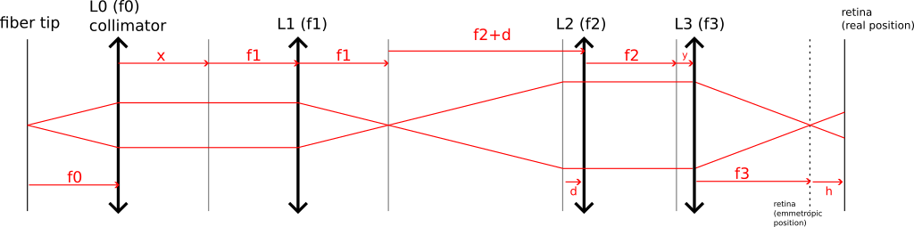

The calculation is performed using the Ray Transfer Matrix (ABCD) method for a complex optical system. This approach considers all the system's parameters, such as the distances between optical elements and the focal lengths, and incorporates them into a second-order matrix that encapsulates the characteristics of the entire optical system.

Fig1:  Illuminated telescope with an integrated Badal system. ***d*** represents the optical delay caused by axial displacement, serving as a model for various refractive errors. ***h*** is the displacement of the real retina position and the retina emmetropic position. 

The Ray Transfer Matrix for each optical element and the whole optical system can be determined by running the Python ***‘20241202_RTM_optical_calculation_illumination.ipynb’***.

  Ray Transfer matrix $\begin{bmatrix}A &B \\C & D \end{bmatrix}$  |   Formular   | 
--- | :--------
Transverse magnification (A) from [after collimator]  to [before L3]  |  $M_T=-\frac{d.y - f_2^2}{f_1.f_2 } $|
Angular magnification (D) from [after collimator]  to [before L3]   |  $M_A=-\frac{d.x - f_1^2}{f_1.f_2 } $ |
Optical distance from fiber tip to retina (B) |$l=-\frac{f_0.(d.f_3^2+ d.f_3.h-d.h.y+f_2^2.h)}{f_1.f_2.f_3 } $  | 
Optical power (C) | |	

Tab1: Ray Transfer Matrix (RTM) of the whole optical system

The system requires two main characteristics: it is telecentric, ensuring magnification remains independent of the distance between the lenses, and it conjugates the light source from the fiber tip with the retina.

To implement a telecentric system where magnification remains independent of the distance d between the two telescope lenses, the value of ***x*** and ***y*** in the magnification $M_T$ and $M_A$ from the RTM calculation in the Tab2 have to be 0. This means the laser source must be positioned at the focal point of the first lens, while the eye (lens f3) should be placed at the focal point of the second lens in the telescope.
$$ 
M_T=M_A=-\frac{f_2^2}{f_1.f_2 }  \ while \ x=y=0
\tag{1}
$$

To conjugate the fiber tip with the retina, the optical distance from the fiber tip to retina needs to be 0 :
$$
l=\frac{f_0.(d.f_3+d.f_3.h-d.h.y+f_2^2.h)}{f_1.f_2.f_3}=0 
\tag{2}
$$

The relationship between d and h under two conditions: telecentric system  and the beam from the fiber tip is conjugated to the retina \tag{2} is deduced as: 
$$
h=-\frac{d.f_3^2}{d.f_3+f_2^2}
\tag{3}
$$
Also the relationship between  the diopter of the eye (v) and d is expressed as: 
$$
d=-f_2^2.v
\tag{4}
$$
Chosen optical components:

f1= 150 mm, 

f2= 60 mm, 

f3= 16.67 mm

v_min= -20 dioptre
v_max= 10 dioptre

[] | Emmetropia | Hypermetropia | Myopia|
--- | :-------- |:--------| :-------- 
d (mm)| 0 | 72 | -36|
 h (mm)| 0  |-4.168|3.3|	

Tab2: Displacement range of the real retina plane   respect to the optical displacement in the illumination source. 
