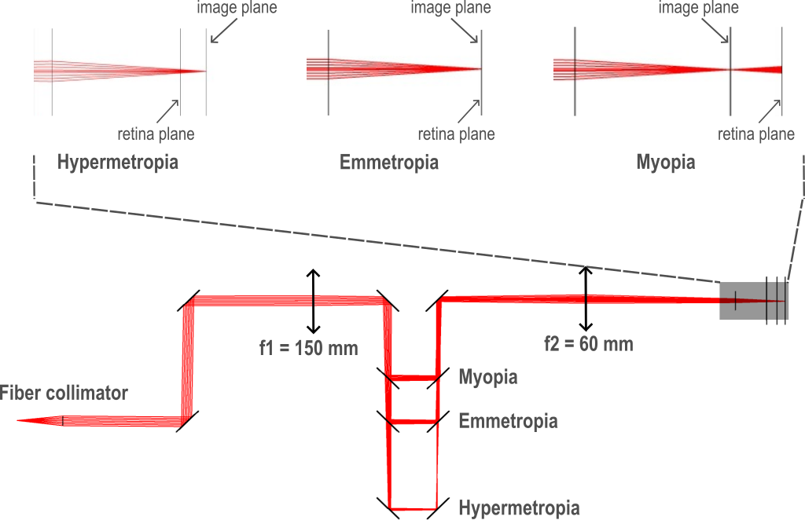

The simulation with Zemax is done to verify all optical distance calculation by RTM (see file ‘20241015_illum_simulation_with_mirrors_trial5_protocol_two_pinholes_2_step_by_step_good.zmx’). The validation confirms that the physical and optical paths align with theoretical predictions, making the setup viable for practical use. 

Important equally, a tolerance calculation and alignment protocol are defined for the realistic system. 

