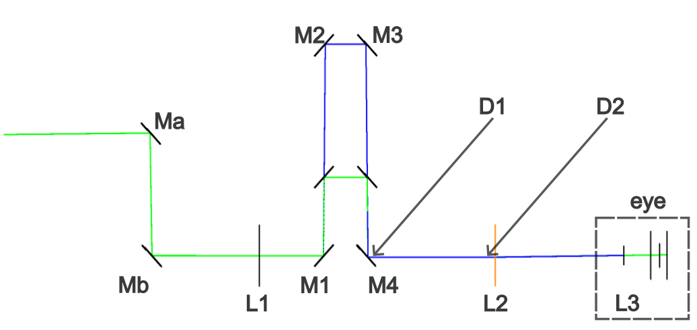

Alignment protocol idea:  (tested in Zemax file 20241015_illum_simulation_with_mirrors_trial5_protocol_two_pinholes_2_step_by_step_good.zmx)

    Steps: 

0) Install the external pinhole + camera alignment accessory (using the same dowel pin holes as provided for coupling with main module).

1) Tune adjustable mirrors Ma and Mb using the iris diaphragms provided near Ma and Mb (using the camera in the accessory), without touching any other mirrors.

2) After fully opening iris diaphragms near Ma and Mb, use iris diaphragms D1 and D2 exclusively for the following operation:

    a.	The translation stage T holding M2 and M3 being in perpetual (sine) motion over its full range, tune only M1 and M4 successively in order to obtain optimal alignment of the beam through D1 and D2.

    b.	Hold T in its position Pn nearest to mirrors M1 and M4, and tune only M2 and M3 successively in order to obtain optimal alingment of the beam through D1 and D2.

    c.	Hold T in its position Pf farthest from M1 and M4, and execute step (b) again at position Pf instead of Pn.

    d.	Repeat steps a,b,c successively in this order, ending with step (a).
    
Once the beam appears to cross the centers (within +/- 25 microns) of both iris diaphragms D1 and D2, regardless of the position of the translation stage T, alignment is complete.

